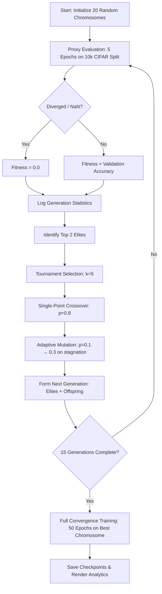
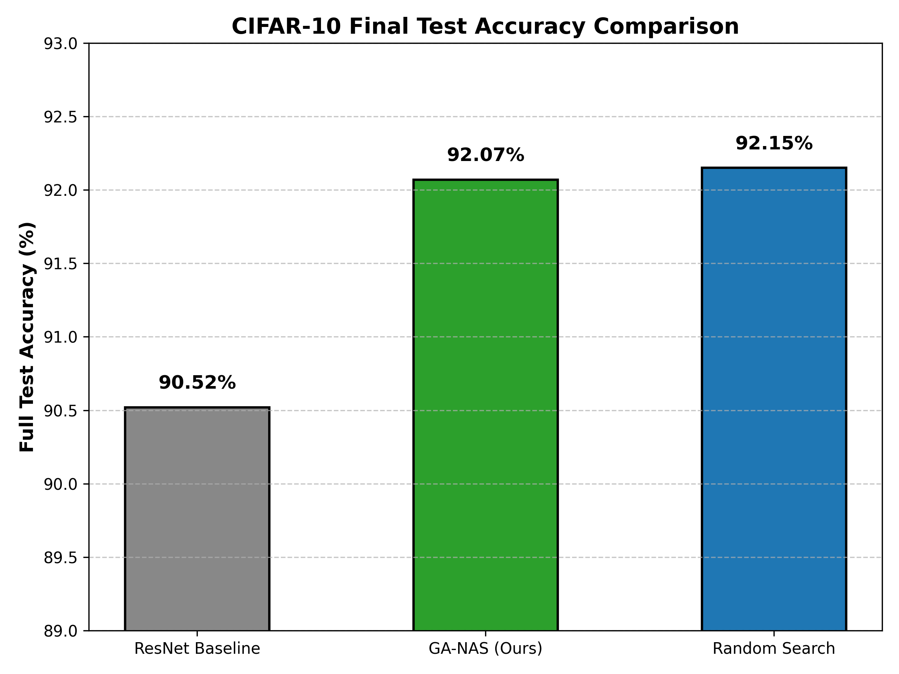
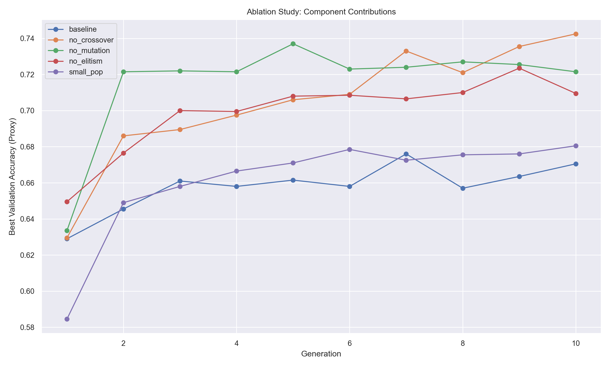
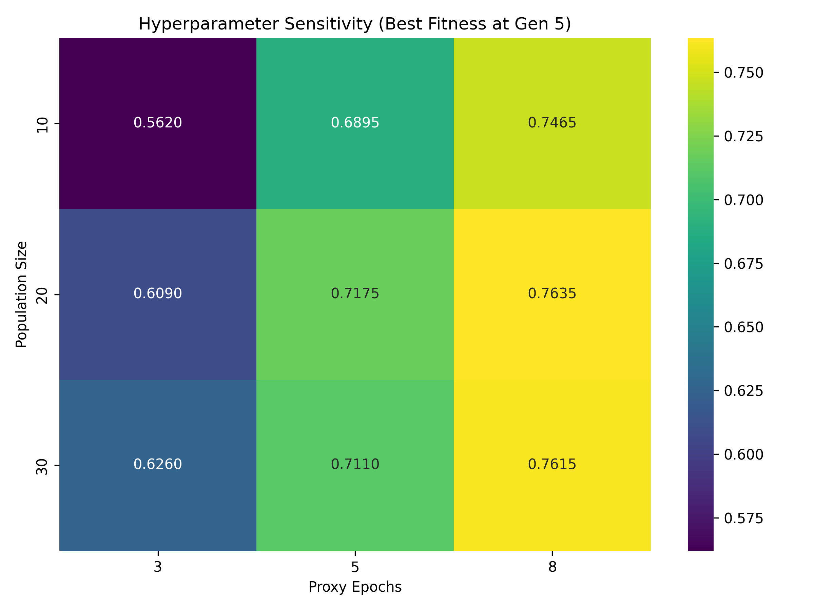
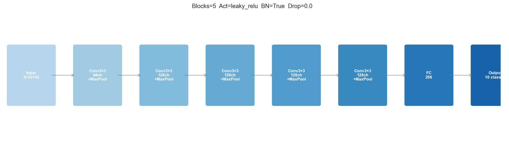

# Neural Architecture Search (NAS) with Genetic Algorithms

[](LICENSE)
[](https://www.python.org/)
[](https://pytorch.org/)
[](https://developer.nvidia.com/cuda-toolkit)

> **CSE_5022 — Advanced Machine Learning** | Autonomous Deep Learning Architecture Discovery

A full-fledged Neural Architecture Search (NAS) system that uses a **Genetic Algorithm (GA)** to automatically discover optimal Convolutional Neural Network (CNN) architectures for image classification on **CIFAR-10**.

---

## 🌟 Key Highlights

- **Autonomous Architecture Design:** Searches across **1,119,744** discrete network configurations without manual intervention.
- **Adaptive Mutation Rate:** Dynamically scales per-gene mutation from $p_m=0.1$ up to $p_m=0.3$ upon detecting 3 consecutive generations of fitness stagnation.
- **Multi-GPU Parallelization:** Supports concurrent population evaluation across dual CUDA devices (`cuda:0` and `cuda:1`) via `ThreadPoolExecutor`.
- **High Performance:** Discovered a 5-block residual CNN that achieved **92.07% Test Accuracy** (19.06M parameters) on full 50-epoch CIFAR-10 convergence.
- **Comprehensive Benchmarks:** Evaluated against a hand-designed ResNet baseline and a compute-matched 300-evaluation Random Search baseline to empirically analyze the **Proxy Gap**.

---

## 🔄 System Architecture & Search Pipeline



---

## ⚙️ Prerequisites

| Requirement | Minimum Version | Notes |
| :--- | :---: | :--- |
| Python | 3.8+ | Tested on 3.10 & 3.12 |
| PyTorch | 2.0+ | With CUDA support |
| CUDA Toolkit | 11.8+ | For GPU evaluation |
| GPU VRAM | 8 GB+ per card | Tested on dual RTX 4060 |
| RAM | 16 GB+ | For DataLoader workers |

---

## 📁 Repository Structure

```
.
├── ga/                     # Evolutionary Algorithm Engine
│   ├── chromosome.py       # 13-gene search space encoding & decoding
│   ├── operators.py        # Tournament selection, crossover, adaptive mutation
│   ├── population.py       # Population initialization & ranking helpers
│   └── engine.py           # Main GA execution loop with stagnation tracking
│
├── models/                 # Dynamic Model Construction & Baselines
│   ├── builder.py          # Dynamic PyTorch CNN builder (ConvBlock, ResidualBlock)
│   └── baselines/
│       ├── resnet.py       # Hand-crafted 3-block ResNet baseline (~2.79M params)
│       └── random_nas.py   # Compute-matched Random Search baseline (300 evals)
│
├── training/               # Data Loading & Training Pipelines
│   ├── config.py           # Search space & training hyperparameter constants
│   ├── evaluator.py        # 5-epoch proxy training & fitness scoring
│   └── trainer.py          # 50-epoch full convergence training with Cosine LR
│
├── utils/                  # Logging & Analytics Visualizer
│   ├── logger.py           # CSV generation logger
│   └── visualiser.py       # Plotting utilities for convergence, heatmaps & diagrams
│
├── experiments/            # Auto-generated Experimental Analytics
│   ├── ablations/          # Genetic operator ablation logs & comparison plots
│   ├── sweep/              # Hyperparameter sensitivity sweep logs & heatmaps
│   ├── generation_logs/    # Generation CSV logs & convergence curves
│   └── best_architectures/ # Winning chromosome JSON configs & architecture plots
│
├── main.py                 # Primary CLI entry point
├── evaluate_best.py        # Standalone full training script for winning chromosome
├── run_ablations.py        # Ablation study runner (5 configurations × 10 generations)
├── run_hyper_sweep.py      # Population vs Proxy Epoch sensitivity sweeper (3×3 grid)
├── train_random_best.py    # Standalone full trainer for random search winner
├── demo_replay.py          # Replay & visualize a saved GA run from CSV logs
├── requirements.txt        # Python dependency manifest
└── README.md               # Project documentation
```

---

## 📊 Empirical Results & Baseline Comparison

We evaluated our evolved **GA-NAS** model against a hand-designed 3-block ResNet baseline and a compute-matched Random Search baseline (300 total evaluations):

| Method / Baseline | Proxy Validation Accuracy (5 Epochs) | Full Test Accuracy (50 Epochs) | Trainable Parameters | Search Strategy / Budget |
| :--- | :---: | :---: | :---: | :--- |
| **GA-NAS (Ours)** | **72.15%** | **92.07%** | **19,061,642 (~19.06M)** | Evolutionary (15 Gen × 20 Pop = 300 evals) |
| **Random Search** | 69.90% | 92.15% | 5,605,130 (~5.61M) | Random sampling (300 random evaluations) |
| **Hand-designed ResNet** | — | 90.52% | 2,789,962 (~2.79M) | Manual design (3-block baseline) |

### 📈 Baseline Accuracy Comparison


---

## 🔬 Scientific Findings: The Proxy Gap & Design Choices

### The Proxy Gap Phenomenon
During the proxy search phase, the GA selected the strongest candidate by short-horizon fitness, achieving **72.15%** proxy accuracy vs. Random Search's **69.90%**. When both were trained to full convergence (50 epochs, 50k samples), the Random Search model reached **92.15%** while GA-NAS achieved **92.07%** — a mere 0.08% difference.

This empirically confirms the **Proxy Gap** in NAS literature: 5-epoch training on a 10k subset acts as a *directionally correct but noisy* fitness signal. Architectures that converge fast under data-scarce, low-epoch conditions are not guaranteed to be those with the highest asymptotic accuracy. The true ranking of architectures can invert under full training conditions.

### Discovered Architectural Innovations
The GA autonomously recovered several design principles from first principles:
- **Residual connections** (`use_residual=True`) — selected consistently for deep architectures without any human guidance
- **Bottleneck filter progression** `[64, 128, 128, 1024, 512]` — aggressive channel expansion at Block 4 before classification compression, mirroring ResNet-50 and EfficientNet design philosophy
- **LeakyReLU over ReLU** — prevents the dead neuron problem through many deep residual layers
- **Zero dropout** — implicit regularisation from BatchNorm + residual gradient shortcuts is sufficient

---

## 🧪 Ablation Study: Genetic Component Contributions

To isolate the impact of each evolutionary component, we ran 5 configurations for 10 generations each (population = 20):

| Configuration | Final Best Proxy Fitness (Gen 10) | Key Observation |
| :--- | :---: | :--- |
| **Full GA-NAS (Baseline)** | `0.6705` | Balanced exploration/exploitation ($P=20, G=10, p_c=0.8, p_m=0.1$) |
| **No Crossover ($p_c=0.0$)** | `0.7425` | Mutation-only exploration reached high-performing regions faster |
| **No Mutation ($p_m=0.0$)** | `0.7215` | Crossover dominated early convergence; stalled without gene renewal |
| **No Elitism ($N_{\text{elites}}=0$)** | `0.7095` | Moderate performance; top models could be lost between generations |
| **Small Population ($P=10$)** | `0.6805` | Consistent underperformer — restricted initial genetic diversity |

### 📉 Ablation Comparison Plot


---

## 🎛️ Hyperparameter Sensitivity Analysis

We evaluated search performance across varying population sizes ($P \in \{10, 20, 30\}$) and proxy epoch durations ($E \in \{3, 5, 8\}$), measuring best proxy accuracy at Generation 5:

| | $E=3$ epochs | $E=5$ epochs | $E=8$ epochs |
| :---: | :---: | :---: | :---: |
| **$P=10$** | ~0.60 | ~0.70 | ~0.74 |
| **$P=20$** | ~0.62 | **0.7175** ✓ | **0.7635** |
| **$P=30$** | ~0.63 | ~0.71 | ~0.76 |

Our selected config ($P=20$, $E=5$, proxy acc = **0.7175**) sits at the **computational efficiency frontier** — increasing to 8 proxy epochs yields only +4.6pp accuracy at ~60% greater compute cost per generation.

### 🌡️ Hyperparameter Heatmap


---

## 🧬 Evolved Architecture Visual Diagram



---

## 🚀 Quick Start Guide

### 1. Install Dependencies
```bash
pip install -r requirements.txt
```

### 2. Smoke Test (CPU — sanity check, ~30 seconds)
```bash
python main.py --smoke --pop 5 --gen 2
```

### 3. Run Full GA Search
```bash
# Single GPU:
python main.py --pop 20 --gen 15 --proxy-epochs 5 --device cuda

# Dual GPU (parallel population evaluation across cuda:0 and cuda:1):
python main.py --pop 20 --gen 15 --proxy-epochs 5 --device cuda --parallel
```

### 4. Full-Train the Discovered Winner
```bash
python evaluate_best.py --device cuda --epochs 50
```

### 5. Run Baselines & Ablations
```bash
# Random Search baseline (300 evaluations, same compute budget as GA):
python main.py --mode random-search --n-eval 300 --device cuda

# Hand-designed ResNet baseline:
python main.py --mode train-resnet --device cuda --full-epochs 50

# Genetic Operator Ablation Suite (5 configs × 10 generations):
python run_ablations.py

# Hyperparameter Sensitivity Sweep (3×3 population × proxy-epoch grid):
python run_hyper_sweep.py
```

### 6. Replay a Saved GA Run
```bash
# Visualize and replay fitness curves from saved CSV generation logs:
python demo_replay.py
```

---

## 📚 References

- He, K., Zhang, X., Ren, S., & Sun, J. (2016). *Deep Residual Learning for Image Recognition.* CVPR.
- Pham, H., Guan, M., Zoph, B., Le, Q., & Dean, J. (2018). *Efficient Neural Architecture Search via Parameter Sharing.* ICML. (ENAS)
- Liu, H., Simonyan, K., & Yang, Y. (2019). *DARTS: Differentiable Architecture Search.* ICLR.
- Real, E. et al. (2019). *Regularized Evolution for Image Classifier Architecture Search.* AAAI. (AmoebaNet)
- Zoph, B., & Le, Q. V. (2017). *Neural Architecture Search with Reinforcement Learning.* ICLR.
- Goldberg, D. E. (1989). *Genetic Algorithms in Search, Optimization and Machine Learning.* Addison-Wesley.
- Fortin, F.-A. et al. (2012). *DEAP: Evolutionary Algorithms Made Easy.* JMLR.

---

## 📄 License

This project is licensed under the Apache License 2.0 — see the [LICENSE](LICENSE) file for details.
