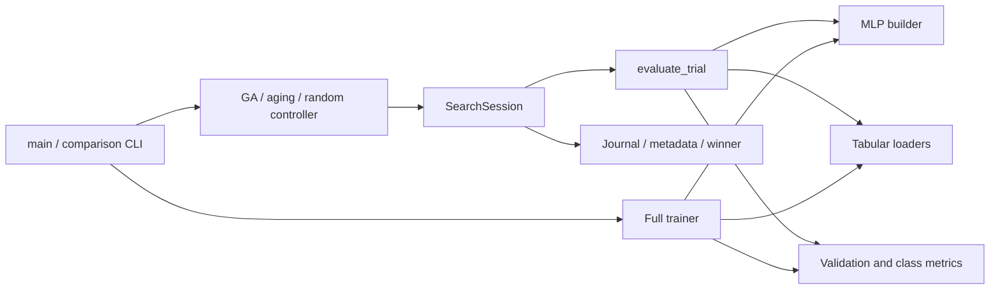

# Codebase map

## Start with the core execution path

Read `main.py` → the chosen controller in `ga/` or `models/baselines/random_nas.py`
→ `utils/search_runtime.py` → `training/evaluator.py` → `data/tabular.py` and
`models/mlp.py`. Then read `run_comparison.py` and `training/trainer.py` to follow
repeated comparisons and full retraining. Recovery lives mainly in the shared
runtime, not in separate algorithm-specific checkpoint implementations.

## Dataset modules

| File | Important interfaces and responsibilities |
| --- | --- |
| `data/specs.py` | `DATASETS`, library default/dimensions, `dataset_spec(name)`, and `search_sizes(...)`; validates task names and resolves proxy sizes without loading data or importing training libraries |
| `data/tabular.py` | `prepare_dataset` explicitly downloads Covertype; `_raw` reads cached/raw data; `_split` builds partitions and training-only scaling; `dataset_metadata` exposes provenance; `get_full_loaders` returns train/validation/test; `_subset` and `_proxy_datasets` fix stratified subsets; `get_proxy_loaders` creates fresh shuffled loaders over cached tensors |

`INPUT_FEATURES` and `NUM_CLASSES` remain importable from `data.tabular` for
existing callers, but their definitions come from `data.specs`. New model code
imports the lightweight specs module directly. Underscore-prefixed helpers are
implementation details, although the training-example exporter uses `_raw`.

## Architecture and search policy

| File | Important interfaces and responsibilities |
| --- | --- |
| `ga/chromosome.py` | `SEARCH_SPACE`, schema 3, ordered gene names/values; `random_chromosome`, `decode`, `chromosome_to_str`, and `describe` |
| `models/mlp.py` | `HiddenLayer`, `build_model`, exact `estimate_parameters`, actual `count_parameters`, and optional `build_baseline_mlp`; no dataset fetching |
| `ga/population.py` | `init_population`, `get_ranked`, `get_top_k`, and `get_best`; paired chromosome/fitness ranking |
| `ga/operators.py` | `tournament_select`, `select_parents`, `single_point_crossover`, per-gene `mutate`, and aging's expressed-choice `mutate_active` |
| `ga/engine.py` | `run_nas`; generation loop, elites, tournaments, crossover, adaptive mutation, and budget truncation |
| `ga/aging.py` | `run_aging_evolution`; tournament parent selection, one active mutation, and FIFO replacement |
| `models/baselines/random_nas.py` | `run_random_search`; independently sampled chromosomes using the same session/evaluator as evolution |

Controllers accept an optional injected evaluator for deterministic unit tests.
Such saved winners are excluded from real retraining because test scores are not
evidence of a trained candidate. The fixed MLP helper remains for tests and the
explicit `train-mlp` mode; it is not included in the three-method suite.

## Shared training and scoring

| File | Important interfaces and responsibilities |
| --- | --- |
| `training/config.py` | The maintained shared constants: full epochs 100, learning rate 0.001, weight decay 0.0001, seed 42 |
| `training/evaluator.py` | `evaluate_trial` builds/trains/scores one proxy candidate; `validate` computes sample-weighted evaluation and confusion counts |
| `training/metrics.py` | `classification_metrics(matrix)` derives class-balanced and per-class diagnostics from a square nonnegative confusion matrix |
| `training/trainer.py` | `train_winner` validates and delegates saved-winner retraining; `full_train` builds searched/baseline models; `train_model` executes full training/checkpoint selection; `evaluate_checkpoint` explicitly records a final test score |

Full training records its implementation fingerprint before training begins.
The proxy and full loops intentionally remain distinct: proxy scores the final
epoch without a checkpoint, while full training evaluates each epoch and restores
the best checkpoint. They share model construction, optimizer constants, seeding,
loaders, validation, and metrics. Combining them into a configurable mega-loop
would add complexity without removing meaningful duplication.

## Runtime, persistence, and plotting utilities

| File | Important interfaces and responsibilities |
| --- | --- |
| `utils/search_runtime.py` | `validate_budget`, `resolve_device`, `evaluate_task`, `SearchSession`, and `resume_search`; config/provenance checks, private trial seeds, evaluator calls, replay validation, winner archive, and durable records |
| `utils/persistence.py` | `atomic_json` writes/fsyncs a temporary file and replaces the destination; `RunLock.acquire/release` provides OS-managed process locks |
| `utils/reproducibility.py` | `set_training_seed`; independent training RNG initialization and deterministic PyTorch settings |
| `utils/provenance.py` | `source_fingerprint`; relative source-file SHA-256 values and aggregate digest captured before experiments, including uncommitted contents |
| `utils/results.py` | `load_winner` validates compatible real winners; `latest_winner` finds the newest compatible winner in one directory |
| `utils/logger.py` | `GenerationLogger`; per-generation/cycle CSV summaries and reconstruction of completed generation timing during resume |
| `utils/visualiser.py` | Optional `plot_convergence`, `plot_architecture`, `plot_gene_heatmap`, and `plot_comparison_bar`; saved Matplotlib figures, not model-search decisions |

`SearchSession` is the most stateful component. Its context entry resolves the
device, locks the run, checks dependencies/data/subsets on resume, opens the
journal, and writes metadata. `evaluate` reuses archived trials or evaluates new
ones. `_record` flushes the journal before updating metadata; `_accept` tracks
counts/time and the historical winner. `finish` saves a winner JSON; context exit
records completion/failure and always releases the lock. See the recovery guide
before changing any of these ordering guarantees.

## Root command-line scripts

| Script | Purpose |
| --- | --- |
| `prepare_dataset.py` | Explicit supported-dataset preparation/download |
| `verify_environment.py` | Exact dependency-pin verification, tiny offline training on the requested device, and optional exported-model/API checks |
| `main.py` | Individual GA, aging, random search, searched-winner training, optional fixed MLP training, plotting, and individual search resume |
| `run_comparison.py` | Equal-budget repeated three-method comparisons; optional per-winner full retraining; durable comparison resume |
| `evaluate_best.py` | Saved-winner retraining or explicit frozen-checkpoint test evaluation |
| `calibrate_proxy.py` | Unique effective architectures, short-vs-long validation ranking, average tied ranks, Spearman correlation, and top-k overlap |
| `run_ablations.py` | GA operator variants: baseline settings, no crossover, no mutation, no elites, and smaller population |
| `run_hyper_sweep.py` | Population/proxy-epoch grid; records candidate budget and unequal epoch costs |
| `audit_scoring.py` | Replays saved proxy winners on CUDA; independently computes prediction accuracy and float64 cross-entropy |
| `benchmark_search.py` | Separate optional NATS-Bench topology lookup; has its own six-edge image architecture encoding and no tabular model training |
| `generate_comparison.py` | Optional plots of explicitly supplied full-training results; refuses mixed dataset comparisons or missing scores |
| `demo_replay.py` | Optional animation of an existing generation CSV |
| `make_example.py` | Writes one raw training row as an inference request after verifying the dataset fingerprint |
| `export_model.py` | Exports a trained checkpoint plus preprocessing manifest |
| `run_portfolio.py` | Optional all-in-one comparison/finalization/export/inference measurement/report delivery |
| `report_results.py` | Optional conversion of a comparison and its local files into dashboard JSON |
| `serve.py` | Optional CUDA inference API and local dashboard launcher |

The NATS-Bench code is retained because it is a tested, separate stored-benchmark
experiment, rather than an unused second implementation of the current model
builder. Its numerical results must never be presented as Covertype results.

## Optional inference and presentation modules

| File | Responsibilities |
| --- | --- |
| `serving/artifact.py` | `feature_names`, `export_artifact`, and `Predictor`; manifests/checksums, saved scaling, model loading, input checks, prediction probabilities, source labels, and synchronized CUDA timing |
| `serving/api.py` | `PredictRequest`, `create_app`, lifespan model loading, numeric validation, error responses, request timing, and fixed local routes |
| `serving/dashboard.html` | Existing static page and styling |
| `serving/dashboard.js` | Existing cards, trajectories, tables, class inspection, example loading, and prediction requests |
| `reporting/comparison.py` | `read`, `build_report`, and `save_report`; trajectories, validation-only model selection, means/sample standard deviations, and atomic report writes |

These components remain optional and unchanged by the current dashboard/report
deferral. They are documented so their existence and limitations are clear.

## Support files and retained local state

`requirements.txt` declares broad core dependencies; `requirements-gpu.txt` adds
the tested CUDA torch build; `requirements-tested-cpu.txt` pins CPU CI dependencies;
`requirements-service.txt` pins optional API/test dependencies; and
`requirements-benchmark.txt` supports the optional NATS lookup.

`.github/workflows/tests.yml` runs Windows CPU unit checks and smoke comparisons.
It also defines an Ubuntu Docker build and HTTP prediction/restart/failure check.
`utils/records.py` handles relative experiment references. `relocate_experiment.py`
copies/migrates experiment paths; `quickstart.py` runs the short real workflow;
`predict_example.py` predicts without training; `model_bundle.py` and
`serving/bundle.py` package/install pinned-checksum model artifacts. Container
verification helpers live in `scripts/`. See [portable delivery](portable-delivery.md).
`Dockerfile` is an optional CPU serving image; `.dockerignore` excludes datasets,
experiments, weights, and local environments. `.gitignore` keeps new tabular runs
and inference exports local. `LICENSE` is the project license. Package
`__init__.py` files define import boundaries and are intentionally kept even when
empty. `analysis/` is existing untracked local material and is not modified by cleanup.
