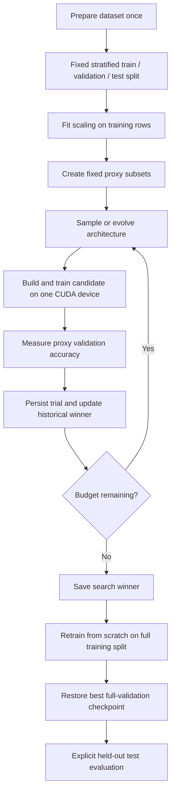

# Project overview

## What the project does

Given a supported tabular classification dataset, the system searches a finite
space of small neural networks. A candidate is an architecture, not a set of
trained weights. Each candidate is built, initialized, trained, and validated.
The genetic algorithm uses measured performance to produce later candidates;
aging evolution and random search provide alternative search policies.

The output is the highest-scoring valid architecture observed under the configured
budget. This is the operational meaning of "best": best among the candidates
evaluated, for this dataset, objective, seed schedule, training protocol, and budget.
It does not certify that every possible architecture was examined.

The project currently supports Covertype and Breast Cancer Wisconsin. Covertype
is the main experiment; Breast Cancer is the small offline library/test default.
There is no generic arbitrary-CSV ingestion or regression pipeline. The metric
is validation accuracy, and changing the search objective requires code changes.
Balanced accuracy and macro F1 are diagnostics rather than selection objectives.

## Important terminology

| Term | Meaning in this repository |
| --- | --- |
| Chromosome | Nine integer indices selecting architecture choices |
| Architecture | Decoded depth, widths, activation, dropout, LayerNorm, and residual flag |
| Candidate evaluation / trial | One architecture trained from scratch for the proxy schedule |
| Fitness | Accuracy on the fixed proxy validation set after the last proxy epoch |
| Proxy | Smaller fixed training/validation subsets and a shorter training schedule |
| Search seed | Controls architecture sampling, selection, crossover, and mutation |
| Training seed | Controls initialization and training shuffle for one evaluation |
| Split seed | Controls data partitioning and fixed stratified subsets |
| Historical winner | Earliest highest-scoring valid trial observed anywhere in a search |
| Full retraining | New training from scratch of a searched architecture on the full training split |
| Checkpoint | Weights from the earliest epoch with the highest full validation accuracy |
| Final test evaluation | Explicit scoring of a frozen checkpoint on previously withheld test rows |
| Smoke run | Synthetic-score orchestration check; no trained model or performance evidence |

## Core workflow

`main.py` runs one search. `run_comparison.py` repeats methods and seeds with the
same candidate budget, optionally retraining every winner. It leaves test scores
unset. `evaluate_best.py` retrains one saved winner or evaluates an already trained
checkpoint. The optional `run_portfolio.py` selects a full-trained winner by
validation and adds test evaluation, model export, inference timing, and a report.

## Design choices and their reasons

- **One GPU, sequential training.** The target is a laptop RTX 4060. There is no
  multi-device scheduler, worker pool, or DataParallel branch to understand.
- **Shared evaluator.** All three search policies use `SearchSession` and
  `evaluate_trial`; policy differences do not imply separate scoring code.
- **Equal evaluation budgets.** Each method receives the same number of trials.
  Training epochs and subsets also match. GPU seconds can differ with model size.
- **Independent randomness.** Policy randomness uses a private Python RNG;
  candidate training reseeding cannot change the controller's decisions.
- **Fixed held-out data.** Methods cannot gain an advantage from different
  subsets, and preprocessing never uses validation or test rows to fit a scaler.
- **Historical winner archive.** Population replacement cannot erase the best
  architecture already measured.
- **Durable trial journal.** A restart reconstructs search state from completed
  observations rather than paying to train those candidates again.
- **Separate proxy and full training.** Short proxy training controls cost;
  full retraining measures the searched architecture under the longer protocol.

## What the system optimizes and what it does not

The genes control the network architecture. Adam settings, the learning rate,
weight decay, batch size, epoch count, data split, and objective are configured
outside the chromosome. There is no joint optimizer/hyperparameter search, early
stopping scheduler, learned mutation policy, or multi-objective Pareto search.
The optional parameter limit is a rejection constraint, not a size objective.

Covertype is imbalanced. Optimizing overall accuracy can favor its common classes;
the additional metrics make that tradeoff visible. Strong tabular baselines and
cross-dataset claims are outside the current three-search-method comparison.

## Current purpose

The hiring story is implementation quality: search policies, correct evaluation,
reproducible single-GPU experiments, recovery after failure, tested model
construction, and readable operating instructions. It does not depend on claiming
that genetic search always wins. Research extensions are preserved separately in
[research-direction.md](research-direction.md).
